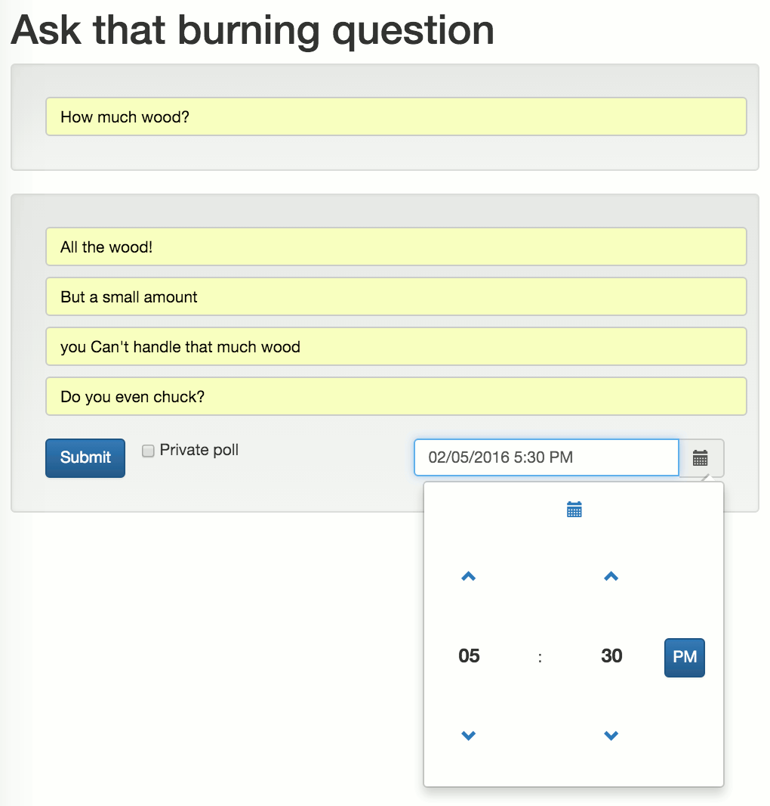
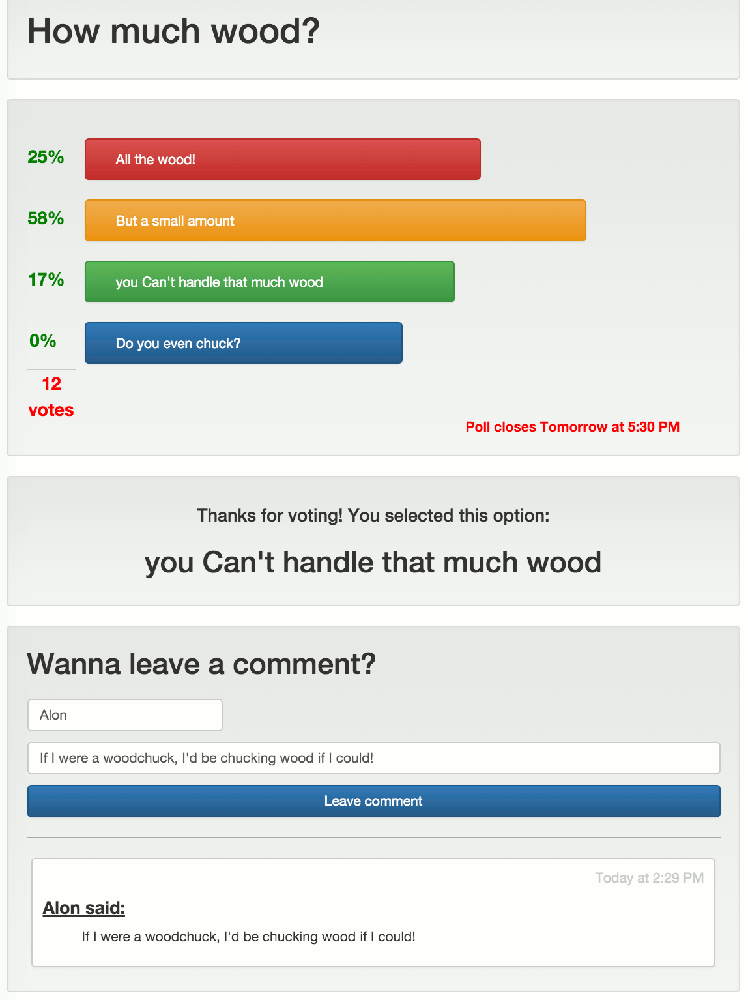

# Crowdsource
This is an easy-to-use polling app with live updating via web sockets.
**Links to mess around with a playable demo**
[Create a new poll](https://mowalon-crowdsource.herokuapp.com/)

[Public poll, voting page](https://mowalon-crowdsource.herokuapp.com/poll/publicdemo)

[Public poll, admin page](https://mowalon-crowdsource.herokuapp.com/admin/publicdemo)

## Notable pieces of this project
**Live updates using web sockets**

When a user has a poll loaded in a browser, changes made by anyone else automatically appear in real time. This applies to poll results and the variable width visualization for each possible response, closing or reopening of the poll by the admin, addition of comments.

**Local storage handling**

A user can leave the poll and return later without losing track of what option was selected in the past. This allows the user to change the vote as desired and limits the likelihood of accidental duplicate voting (intentional duplication of votes by using a different browser or clearing the local storage is still possible).

**User and admin views**

Upon creating a poll, the creator/admin is given an admin link along with the public link to be shared. Behind-the-scenes, it's really the same page, but information and interaction is limited based on what link is used. For example, the admin can't vote on the poll but can adjust the expiration date and time. A user who's voted will see a message confirming what vote has been cast. Also, if the poll is private, the results aren't shown in the public view, but the admin can always see results.

## Screenshots

Creating a new poll!

After you've voted

